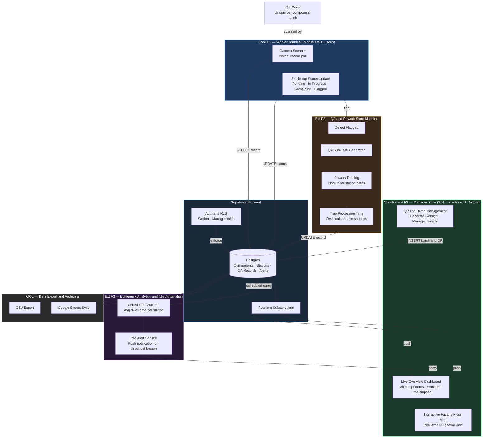

# Mega Precision Tracking
### QR-based production component tracking for manufacturing SMEs

> NUS Orbital 2026 — Team MengKiaKNIGHT — Apollo 11

---

## Motivation

Manufacturing SMEs in Singapore — particularly in the semiconductor space — often lack systems for tracking component statuses across workstations. This causes delays, miscommunication, and production disruptions. TrackFlow gives workers a frictionless way to update component statuses on the floor, and gives managers a live, consolidated view of the entire production pipeline.

---

## Features

**Core**
- **QR Code Generation & Scanning** — Unique QR tags per component batch; in-app camera scanner pulls up records instantly
- **Real-Time Status Updates** — Workers tap to transition statuses (`Pending → In Progress → Completed → Flagged`) after scanning
- **Manager Dashboard** — Live web view of all active components, current stations, and time elapsed per stage

**Extension**
- **Bottleneck Analytics** — Average time per station surfaced automatically; weekly performance reports generated
- **Idle Alerts** — Push notifications to managers when a component exceeds a configurable dwell threshold
- **Data Export & Archiving** — One-click CSV export and Google Sheets sync for auditing and offline analysis

---

## Tech Stack

| Layer | Technology |
|---|---|
| Frontend | Next.js (App Router) + React |
| PWA | `@ducanh2912/next-pwa` |
| Database & Realtime | Supabase (Postgres + Realtime subscriptions) |
| Auth | Supabase Auth |
| QR Generation | `qrcode` |
| QR Scanning | Browser MediaDevices API |
| Data Export | Google Sheets API / CSV |
| Hosting | Vercel |
| Version Control | Git & GitHub |

The app is a PWA — no installation required. Workers access the scan interface at `/scan` from any mobile browser; managers access the dashboard at `/dashboard` on desktop.

---

## Architecture



---

## Milestones

| Milestone | Date | Deliverable |
|---|---|---|
| 1 | 1 Jun | Proof of concept — scan a QR, fetch a dummy component, update status |
| 2 | 29 Jun | Prototype — real-time DB integration, live manager dashboard |
| 3 | 27 Jul | Extended system — analytics, idle alerts, Google Sheets export |

---

## Getting Started

### Prerequisites
- Node.js 18+
- A Supabase project ([supabase.com](https://supabase.com))

### Installation

```bash
git clone https://github.com/cmengu/<repo-name>
cd <repo-name>
npm install
```

### Environment Variables

Create a `.env.local` file:

```env
NEXT_PUBLIC_SUPABASE_URL=your_supabase_url
NEXT_PUBLIC_SUPABASE_ANON_KEY=your_supabase_anon_key
```

### Development

```bash
npm run dev
```

Open [http://localhost:3000](http://localhost:3000).

---

## Software Engineering Practices

- **Agile sprints** aligned to Orbital milestones
- **Feature branching** with pull requests and peer review before merging to `main`
- **Component separation** — scan logic, status logic, and UI kept independently testable
- **Automated testing** — unit tests for core status transition and QR processing logic

---

## Team

| Name | Role |
|---|---|
| MengKiaKNIGHT | Full-stack |

---

*NUS School of Computing — Orbital (CP2106) 2026*
